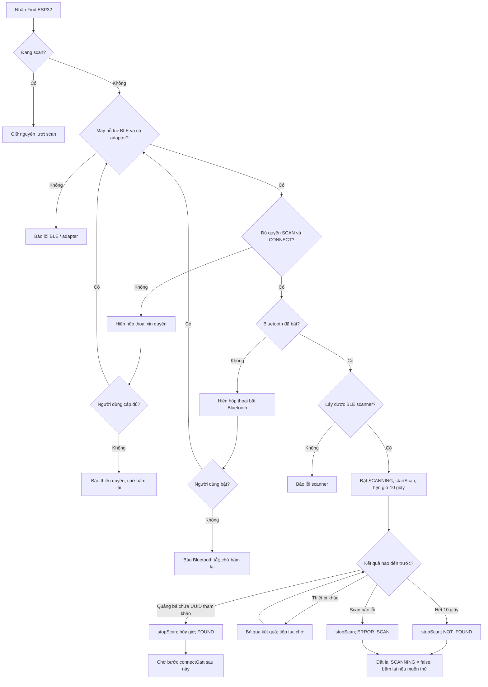

# Flowchart M1 — tìm quảng bá ESP32 qua BLE

Sơ đồ này mô tả phần app **đã có** trong `MainActivity.kt`: tìm quảng bá chứa service UUID tham khảo. `FOUND` chỉ nghĩa là đã thấy quảng bá; chưa kết nối GATT, xác thực hay mở khóa.

## Đọc từng khối

1. **Điều kiện trước scan:** BLE/adapter, hai quyền và Bluetooth đã bật. Hộp thoại quyền và bật Bluetooth trả kết quả qua callback, rồi kiểm tra lại điều kiện.
2. **Scan:** `startScan()` chỉ bắt đầu quét. `onScanResult()` có thể nhận nhiều thiết bị khác; app tiếp tục quét cho đến khi thấy service UUID tham khảo hoặc có timeout/lỗi.
3. **Dọn dẹp:** `stopScan()` dừng scanner, hủy hẹn giờ, đặt `scanning = false`. Timeout không xóa phiên GATT vì app chưa tạo phiên đó.

**Cần xác minh với Kiệt:** ESP32 thật có đưa UUID `6E400001-B5A3-F393-E0A9-E50E24DCCA9E` vào advertising không. Nếu không, app sẽ báo `NOT_FOUND` dù thiết bị đang phát BLE.
