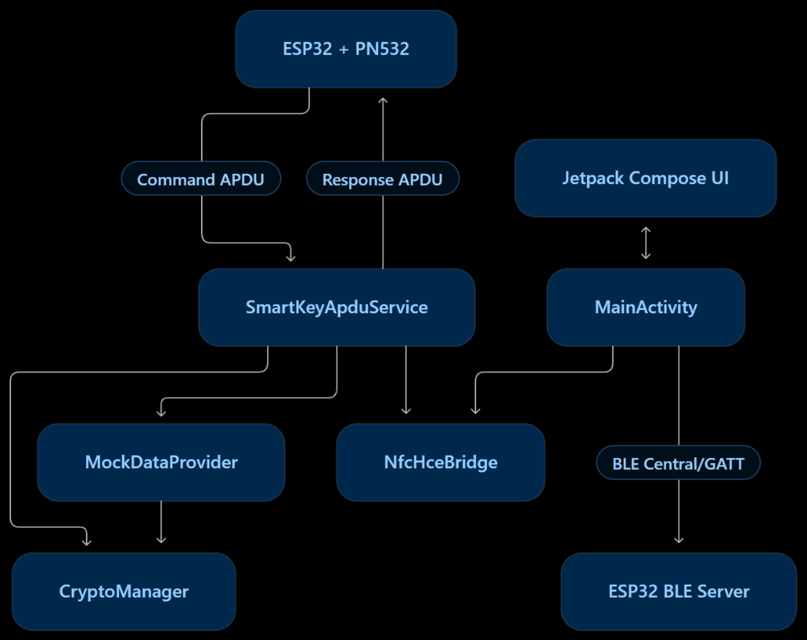
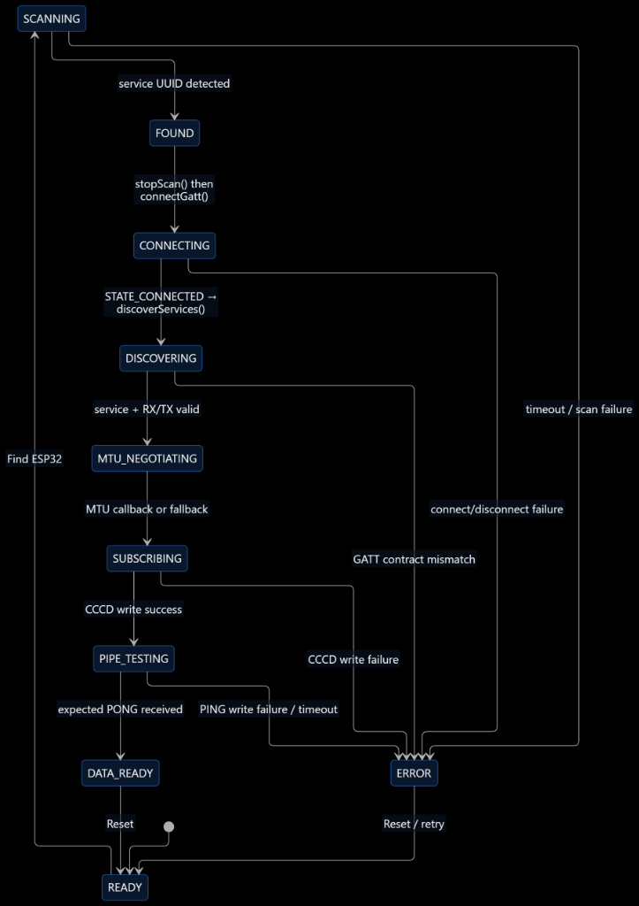
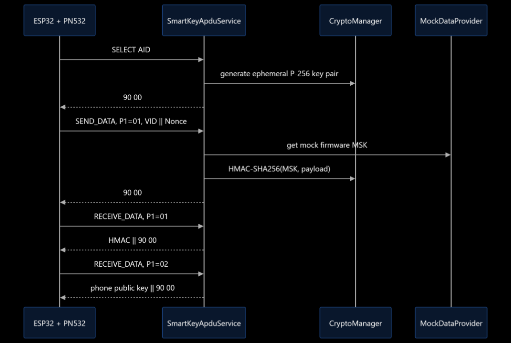

# HỆ THỐNG TRUY CẬP SMART KEY — PHÂN HỆ DI ĐỘNG (SMART KEY MOBILE ACCESS)
## Phân hệ Ứng dụng Di động Android — Hỗ trợ BLE + NFC HCE + Mật mã học cho Nguyên mẫu Smart Key

---

## 1. Tổng quan Dự án

`mobile_app` là phân hệ phía Android của nguyên mẫu Hệ thống Truy cập Smart Key (Smart Key Access).

Cấu trúc các tệp mã nguồn hiện tại của phân hệ gồm:

```text
MainActivity.kt
crypto/
  └── CryptoManager.kt
mock/
  └── MockDataProvider.kt
nfc/
  └── SmartKeyApduService.kt
```

Ứng dụng di động hiện tại bao gồm ba mảng kỹ thuật trọng tâm:

1. **Nền tảng BLE Central / GATT (M1 Baseline)**
   - Quét tìm dịch vụ Smart Key;
   - Tự động dừng quét ngay sau khi phát hiện thiết bị mục tiêu;
   - Thiết lập kết nối GATT trực tiếp;
   - Khám phá dịch vụ bắt buộc và các đặc tính RX/TX;
   - Thương lượng kích thước gói tin (ATT MTU);
   - Đăng ký nhận thông báo (Notify) qua bộ mô tả CCCD;
   - Kiểm chứng đường truyền dữ liệu hai chiều bằng cơ chế `PING → PONG`;
   - Đo đạc và hiển thị độ trễ khứ hồi đường truyền (BLE RTT).

2. **Mô phỏng Thẻ Máy chủ NFC (NFC Host Card Emulation - HCE)**
   - Công bố mã nhận diện ứng dụng (Smart Key AID) cho đầu đọc PN532;
   - Tiếp nhận và phân tích các tập lệnh APDU gửi từ phía ESP32/PN532;
   - Phản hồi mã xác thực HMAC, khóa công khai (Public Key) và chuỗi chứng thực thử nghiệm;
   - Chuyển tiếp các sự kiện trạng thái vòng đời HCE lên giao diện người dùng Jetpack Compose.

3. **Hỗ trợ Mật mã học và Dữ liệu Mẫu (Crypto / Mock Support)**
   - Hàm băm SHA-256;
   - Mã xác thực thông điệp HMAC-SHA256;
   - Sinh cặp khóa ECDH chuẩn NIST P-256 và mã hóa/giải mã tọa độ điểm EC Point;
   - Tính toán bí mật dùng chung (ECDH Shared Secret);
   - Hàm hỗ trợ dẫn xuất khóa phiên HKDF-SHA256;
   - Bộ dữ liệu mẫu `CAR_ID` / `MSK` đồng bộ khớp 100% với firmware ESP32.

Ứng dụng di động **không nắm quyền quyết định mở khóa cuối cùng**. Quyền cấp phép hoặc từ chối truy cập (`GRANT / DENY`) hoàn toàn thuộc về chính sách bảo mật phía phương tiện (xe).

---

## 2. Bài toán Đặt ra

Chiếc điện thoại Smart Key phải tham gia vào chu trình truy cập phương tiện một cách an toàn, không bị suy biến thành một nút bấm mở khóa Bluetooth đơn giản dễ bị tấn công phát lại.

Do đó, phân hệ di động bắt buộc phải có khả năng:

- Phát hiện và thiết lập kênh truyền với bộ điều khiển ESP32 phía phương tiện;
- Cung cấp kênh truyền dẫn BLE hai chiều ổn định, tin cậy;
- Tham gia vào quy trình nạp cấu hình ban đầu (Provisioning) qua NFC / trao đổi HCE;
- Thực thi các tác vụ tính toán phía điện thoại theo hợp đồng xác thực/phiên làm việc đã thỏa thuận;
- Điều phối phiên định vị cự ly UWB phía Android khi tích hợp phân hệ phần cứng;
- Xuất dữ liệu đo đạc (telemetry) phục vụ chẩn đoán lỗi và kiểm chứng thực nghiệm;
- Luôn duy trì cơ chế đóng an toàn khi xảy ra lỗi (fail-closed) nếu thiếu bằng chứng bảo mật hoặc dữ liệu không hợp lệ.

---

## 3. Phạm vi Dự án (Project Scope)

### 3.1 Trong phạm vi (In-Scope — Phân hệ Mobile)

- Quản lý quyền runtime và kiểm tra năng lực phần cứng BLE trên Android.
- Vòng đời quét BLE, kết nối và quản trị kết nối GATT.
- Xác thực dịch vụ GATT và các đặc tính bắt buộc.
- Xử lý thương lượng MTU và cơ chế dự phòng (fallback).
- Đăng ký lắng nghe thông báo qua CCCD.
- Kiểm thử chẩn đoán đường truyền BLE bằng gói tin `PING/PONG` và đo đạc telemetry RTT.
- Điểm cuối mô phỏng thẻ Android HCE.
- Phân tích cú pháp APDU và gửi dữ liệu phản hồi APDU phía điện thoại.
- Hiện thực hóa các thuật toán mật mã phía Android theo hợp đồng giao thức chung.
- Dữ liệu giả lập / kiểm thử (Mock/Test fixtures) phục vụ phát triển độc lập.
- Giao diện người dùng (UI), hiển thị dữ liệu đo đạc và điều phối luồng nghiệp vụ.
- Điều phối phiên UWB phía Android khi phân hệ này được tích hợp vào dự án.

### 3.2 Ngoài phạm vi (Out-of-Scope — Thuộc Phân hệ Khác)

- Ra quyết định đóng/ngắt rơ-le mở khóa cuối cùng của xe (thuộc chính sách bảo mật phía xe);
- Hiện thực hóa GATT Server trên ESP32;
- Driver điều khiển phần cứng đầu đọc PN532 trên firmware;
- Tầng vật lý (PHY) UWB hoặc giao tiếp với chip DW3000 phía xe;
- Tự ý thay đổi định dạng gói tin hoặc thuật toán mật mã ngoài hợp đồng chung.

> **Ranh giới trách nhiệm:** Phân hệ **Bảo mật / Giao thức (Security/Protocol)** định nghĩa hợp đồng mật mã học. Cả hai bản hiện thực hóa trên Android và ESP32 bắt buộc phải tuân thủ nghiêm ngặt hợp đồng đó.

---

## 4. Mô hình Trạng thái Bằng chứng

| Trạng thái | Ý nghĩa kỹ thuật |
|---|---|
| `DESIGN` | Đã lên kế hoạch / đặc tả thiết kế, nhưng bằng chứng hiện thực hóa chưa đầy đủ |
| `MOCKED` | Đang chạy với dữ liệu giả lập / môi trường mô phỏng |
| `IMPLEMENTED` | Mã nguồn đã được viết và biên dịch thành công trong repository |
| `HARDWARE-VERIFIED` | Đã được chứng minh chạy trên phần cứng thực tế kèm log đo đạc |
| `UNKNOWN` | Chưa có đủ bằng chứng xác thực |

> [!NOTE]
> Quy tắc kiểm chứng: Không tự ý nâng một tính năng từ `IMPLEMENTED` lên `HARDWARE-VERIFIED` nếu chỉ mới vượt qua bước biên dịch Gradle mà chưa chạy trên thiết bị thật.

---

## 5. Yêu cầu Chức năng

### 5.1 Yêu cầu BLE

| Mã định danh | Nội dung yêu cầu | Trạng thái bằng chứng |
|---|---|---|
| `MOB-BLE-01` | Ứng dụng phải kiểm tra năng lực BLE và các quyền Android bắt buộc trước khi quét. | `IMPLEMENTED` |
| `MOB-BLE-02` | Ứng dụng phải quét tìm dịch vụ BLE Smart Key kèm thời gian chờ giới hạn (timeout 10s). | `IMPLEMENTED` |
| `MOB-BLE-03` | Ứng dụng phải dừng quét ngay sau khi phát hiện mục tiêu rồi mới mở kết nối GATT. | `IMPLEMENTED` |
| `MOB-BLE-04` | Ứng dụng phải khám phá dịch vụ GATT bắt buộc và kiểm tra RX hỗ trợ `WRITE`, TX hỗ trợ `NOTIFY`. | `IMPLEMENTED` |
| `MOB-BLE-05` | Ứng dụng phải yêu cầu/ghi nhận ATT MTU, cho phép gói M1 4-byte tiếp tục với MTU mặc định nếu cần. | `IMPLEMENTED` |
| `MOB-BLE-06` | Ứng dụng phải đăng ký nhận thông báo TX thông qua bộ mô tả CCCD `0x2902`. | `IMPLEMENTED` |
| `MOB-BLE-07` | Ứng dụng phải kiểm chứng đường truyền BLE hai chiều bằng cặp gói tin `PING → PONG`. | `IMPLEMENTED` |
| `MOB-BLE-08` | Ứng dụng phải đo đạc và hiển thị độ trễ BLE RTT sau khi nhận được gói `PONG` hợp lệ. | `IMPLEMENTED` |
| `MOB-BLE-09` | Khi kết nối BLE thất bại, ứng dụng phải dọn dẹp tài nguyên GATT và duy trì trạng thái đóng an toàn (fail-closed). | `IMPLEMENTED` |

### 5.2 Yêu cầu NFC HCE

| Mã định danh | Nội dung yêu cầu | Trạng thái bằng chứng |
|---|---|---|
| `MOB-NFC-01` | Ứng dụng Android phải công bố mã nhận diện Smart Key AID thống nhất thông qua HCE. | `IMPLEMENTED` |
| `MOB-NFC-02` | Dịch vụ HCE phải tiếp nhận lệnh `SELECT AID` từ PN532 và trả về mã trạng thái ISO 7816 (`90 00`). | `IMPLEMENTED` |
| `MOB-NFC-03` | Dịch vụ HCE phải nhận các gói dữ liệu có gắn thẻ định danh từ ESP32 và cập nhật telemetry lên UI. | `IMPLEMENTED` |
| `MOB-NFC-04` | Dịch vụ HCE phải trả về phản hồi HMAC kỳ vọng tương ứng với khóa kiểm thử hiện tại. | `IMPLEMENTED + MOCKED credential` |
| `MOB-NFC-05` | Dịch vụ HCE phải trả về Public Key của điện thoại đúng định dạng đường truyền firmware yêu cầu. | `IMPLEMENTED` |
| `MOB-NFC-06` | Tương tác NFC phải được kiểm chứng thực tế giữa điện thoại thật và bộ ghép ESP32 + PN532. | `UNKNOWN / chờ bằng chứng thực tế` |

### 5.3 Yêu cầu Mật mã học và Phiên làm việc

| Mã định danh | Nội dung yêu cầu | Trạng thái bằng chứng |
|---|---|---|
| `MOB-CRYPTO-01` | Ứng dụng phải cung cấp các hàm hỗ trợ băm SHA-256 và HMAC-SHA256. | `IMPLEMENTED` |
| `MOB-CRYPTO-02` | Ứng dụng phải sinh cặp khóa ECDH NIST P-256 dùng một lần (ephemeral key pair). | `IMPLEMENTED` |
| `MOB-CRYPTO-03` | Ứng dụng phải mã hóa/giải mã khóa công khai P-256 theo đúng định dạng đường truyền đã thỏa thuận. | `IMPLEMENTED` |
| `MOB-CRYPTO-04` | Ứng dụng phải tính toán bí mật dùng chung ECDH khi nhận được khóa công khai của bên đối tác. | `IMPLEMENTED` |
| `MOB-CRYPTO-05` | Ứng dụng phải dẫn xuất khóa phiên bằng thuật toán HKDF-SHA256 theo đúng quy chuẩn chung. | `IMPLEMENTED` |
| `MOB-CRYPTO-06` | Cơ chế chữ ký/xác thực cuối cùng phải tuân thủ hợp đồng Giao thức/Bảo mật đã chốt và vượt qua bộ test vector chéo nền tảng. | `DESIGN` |

### 5.4 Yêu cầu UWB và Chính sách Truy cập

| Mã định danh | Nội dung yêu cầu | Trạng thái bằng chứng |
|---|---|---|
| `MOB-UWB-01` | Ứng dụng phải điều phối phiên đo cự ly UWB phía Android sau khi thỏa mãn các điều kiện tiên quyết về xác thực/phiên. | `DESIGN` |
| `MOB-UWB-02` | Ứng dụng phải xuất thông tin đo đạc cự ly UWB lên giao diện người dùng. | `DESIGN` |
| `MOB-POL-01` | Ứng dụng Android tuyệt đối không nắm quyền quyết định mở khóa xe cuối cùng. | `BẤT BIẾN HỆ THỐNG (SYSTEM INVARIANT)` |
| `MOB-POL-02` | Bất kỳ sự thiếu hụt hoặc sai lệch nào trong dữ liệu bảo mật đều không được phép dẫn đến trạng thái cấp quyền truy cập. | `BẤT BIẾN HỆ THỐNG (SYSTEM INVARIANT)` |

---

## 6. Kiến trúc Mã nguồn Hiện tại



### Phân công trách nhiệm của các thành phần

#### `MainActivity.kt`
- Kiểm tra năng lực phần cứng BLE và yêu cầu quyền lúc chạy.
- Quản lý quy trình quét BLE kèm bộ đếm thời gian giới hạn (10s timeout).
- Triển khai luồng dừng quét trước khi kết nối (`stopScan()` $\rightarrow$ `connectGatt()`).
- Quản trị vòng đời kết nối GATT và giải phóng handle tránh rò rỉ bộ nhớ.
- Khám phá dịch vụ GATT và kiểm tra tính hợp lệ của đặc tính RX/TX.
- Yêu cầu cấu hình MTU và cơ chế dự phòng về mức mặc định nếu đàm phán bất thành.
- Đăng ký nhận thông báo từ ESP32 thông qua bộ mô tả CCCD.
- Thực hiện kiểm thử đường truyền cơ sở với gói tin `PING/PONG`.
- Đo đạc độ trễ khứ hồi RTT và hiển thị lên giao diện người dùng.
- Xây dựng giao diện bằng Jetpack Compose.
- Lắng nghe StateFlow từ `NfcHceBridge` để hiển thị sự kiện HCE và mã xe (VID) tức thời.

#### `SmartKeyApduService.kt`
- Kế thừa lớp `HostApduService` của nền tảng Android.
- Xử lý các gói tin APDU gửi từ đầu đọc PN532.
- Nhận diện lệnh chọn ứng dụng thẻ qua mã AID (`INS_SELECT = 0xA4`).
- Xử lý lệnh nhận dữ liệu từ ESP32 (`INS_SEND_DATA = 0x10`).
- Xử lý lệnh yêu cầu trả dữ liệu về ESP32 (`INS_RECE_DATA = 0x20`).
- Tính toán phản hồi HMAC tương ứng bằng khóa mẫu MSK đã đồng bộ với firmware.
- Chuẩn hóa và trả về các byte khóa công khai của điện thoại.
- Công bố các sự kiện vòng đời HCE lên UI thông qua `NfcHceBridge`.

#### `CryptoManager.kt`
Các hàm tiện ích mật mã đã được hiện thực hóa:
```text
SHA-256
HMAC-SHA256
Sinh cặp khóa ECDH NIST P-256
Mã hóa / giải mã tọa độ điểm EC Point (chuẩn TLS 66B và Affine X 32B)
Tính toán bí mật dùng chung ECDH (Shared Secret)
Dẫn xuất khóa phiên đối xứng HKDF-SHA256
Chuyển đổi ByteArray <-> HexString
```
*Lưu ý:* Thuật toán mã hóa đối xứng AES-GCM hiện tại vẫn đang ở trạng thái TODO trong mã nguồn.

#### `MockDataProvider.kt`
Chứa các bộ dữ liệu mẫu phục vụ phát triển và kiểm thử:
```text
CAR_ID = 01 02 03 04 05 06 07 08
MSK    = 01 02 ... 20
sample VID / sample MSK / sample nonce
```
Các giá trị này là dữ liệu thử nghiệm phục vụ kiểm thử cục bộ, không dùng làm khóa thực tế trên xe.

---

## 7. Máy Trạng thái Thời gian chạy BLE (BLE Runtime State Machine)



Trạng thái `DATA_READY` có ý nghĩa là đường truyền BLE hai chiều thuộc Milestone M1 đã được kiểm chứng hoạt động thành công qua gói tin `PONG`.  
Trạng thái này **không đồng nghĩa** với việc quá trình xác thực mật mã, đo cự ly UWB hay cấp quyền truy cập xe đã hoàn tất.

---

## 8. Hợp đồng Giao diện BLE GATT

| Thành phần | UUID (128-bit) | Thuộc tính bắt buộc | Mục đích sử dụng |
|---|---|---|---|
| Dịch vụ (Service) | `6E400001-B5A3-F393-E0A9-E50E24DCCA9E` | Primary | Dịch vụ Smart Key chính, dùng trong gói quảng bá để lọc thiết bị |
| Đặc tính RX | `6E400002-B5A3-F393-E0A9-E50E24DCCA9E` | `WRITE` | Điện thoại gửi dữ liệu xuống ESP32 |
| Đặc tính TX | `6E400003-B5A3-F393-E0A9-E50E24DCCA9E` | `NOTIFY` | ESP32 gửi thông báo dữ liệu về điện thoại |
| Bộ mô tả CCCD | `00002902-0000-1000-8000-00805f9b34fb` | Descriptor | Ghi `0x0001` để kích hoạt thông báo TX trên máy chủ GATT |

### Gói tin Chẩn đoán Baseline M1

```text
Điện thoại → ESP32 : Gửi chuỗi ASCII "PING" (4 bytes)
ESP32 → Điện thoại : Phản hồi chuỗi ASCII "PONG" (4 bytes)
```

Gói tin này chỉ nhằm mục đích chứng minh đường truyền dữ liệu hai chiều đã thông suốt.

---

## 9. Hợp đồng Giao tiếp NFC HCE — Mã nguồn Hiện tại

### 9.1 Mã nhận diện Ứng dụng (AID)

```text
F0 53 4D 41 52 54 4B 45 59
```

Phần ký tự ASCII tương ứng:

```text
"SMARTKEY"
```

Lệnh chọn AID (SELECT AID) chuẩn mà mã nguồn mong đợi nhận từ PN532:

```text
00 A4 04 00 09 F0 53 4D 41 52 54 4B 45 59 00
```

### 9.2 Các Byte Mã lệnh APDU (Instruction Bytes)

```text
INS_SELECT     = 0xA4    // Lệnh chọn ứng dụng thẻ qua AID
INS_SEND_DATA  = 0x10    // ESP32 gửi dữ liệu sang Điện thoại
INS_RECE_DATA  = 0x20    // Điện thoại gửi dữ liệu về ESP32
```

### 9.3 Các Thẻ Dữ liệu Tham số 1 (P1 Data Tags)

```text
0x01 = Nhánh dữ liệu VID / Nonce / Băm HMAC
0x02 = Nhánh trao đổi Khóa công khai (Public Key)
0x03 = Nhánh thách đố Nonce / Token chứng thực
```

### 9.4 Hành vi APDU Hiện tại



> [!NOTE]
> **Lưu ý tương thích bộ đệm firmware (`nfc.cpp`):**
> Hàm `receive_data()` trên ESP32 hiện khai báo mảng đệm `response[32]`. Chuẩn ISO/IEC 7816-4 và Android HCE luôn gửi kèm 2 bytes mã trạng thái `SW1-SW2` (`0x90 0x00`) ở cuối payload (tổng 34 bytes khi trả về Public Key 32B hoặc HMAC 32B). Firmware cần cấu hình kích thước bộ đệm tối thiểu `response[64]` để tránh bị thư viện PN532 cắt cụt mã trạng thái.

---

## 10. Các Hạn chế Quan trọng Hiện tại

### 10.1 Đã có code HCE nhưng kiểm chứng phần cứng vẫn là một bước riêng biệt
Sự hiện diện của tệp `SmartKeyApduService.kt` cho thấy điểm cuối HCE đã hoàn thành trong mã nguồn.

Tuy nhiên, để đạt trạng thái `HARDWARE-VERIFIED`, hệ thống bắt buộc phải thu thập bằng chứng từ phần cứng thật:
```text
PN532 phát lệnh SELECT AID
→ Dịch vụ Android nhận được gói APDU
→ Android trả về mã phản hồi hợp lệ
→ ESP32/PN532 ghi nhận log đúng các byte đó
```
Dự án đã khai báo đầy đủ thẻ `<service>` trong `AndroidManifest.xml` và tệp cấu hình AID trong `res/xml/apduservice.xml`.

### 10.2 HMAC hiện tại sử dụng khóa MSK mẫu của firmware
Dịch vụ HCE hiện tại đang lấy khóa trực tiếp từ:
```text
MockDataProvider.FIRMWARE_MSK_32B
```
Do đó, nhánh tính toán HMAC này đóng vai trò là môi trường phục vụ tích hợp thử nghiệm giữa hai nhóm.  
Khi triển khai thương mại, khóa này sẽ được nạp qua Master Card vật lý và lưu trong Android KeyStore có bảo vệ phần cứng.

### 10.3 "Chứng thực chữ ký" hiện tại chưa phải là chữ ký số ECDSA
Mã nguồn HCE hiện tại đang phản hồi:
```text
SHA256(cachedHmac)
```
cho nhánh chứng thực `P1 = 0x03`.

Đây là token thử nghiệm tạm thời nhằm xác nhận chuỗi băm phiên, chưa phải chữ ký số mật mã bất đối xứng ECDSA NIST P-256 ký bằng Private Key.

### 10.4 Các hàm hỗ trợ ECDH / HKDF đi trước tích hợp đầu-cuối
Lớp `CryptoManager` hiện đã có thể:
```text
Giải mã khóa công khai của đối tác
→ Tính toán bí mật dùng chung ECDH (Shared Secret)
→ Dẫn xuất khóa phiên thông qua HKDF
```
Luồng tương tác HCE hiện thời đang tập trung kiểm thử 7 bước APDU cơ bản trước khi tích hợp chuỗi dẫn xuất khóa đầy đủ.

### 10.5 AES-GCM chưa được hiện thực hóa trong CryptoManager
Mã nguồn hiện tại vẫn còn chứa ghi chú `TODO` đối với thuật toán mã hóa đối xứng AES-GCM.

---

## 11. Bảng Ma trận Truy vết Yêu cầu (Requirement Traceability)

| Yêu cầu | Thiết kế tương ứng | Tệp mã nguồn hiện thực | Mục tiêu kiểm chứng thực nghiệm |
|---|---|---|---|
| `MOB-BLE-02` | Quét BLE kèm timeout | `MainActivity.startFindingEsp32()` | Bắt được gói quảng bá thật + kích hoạt timeout |
| `MOB-BLE-03` | Dừng quét trước khi kết nối GATT | `scanCallback`, `connectToTarget()` | Bản ghi log kết nối radio sạch sẽ |
| `MOB-BLE-04` | Xác thực hợp đồng Service + RX/TX | `onServicesDiscovered()` | Bằng chứng về UUID và thuộc tính Property |
| `MOB-BLE-05` | Đàm phán MTU kèm fallback | `requestMtu()`, `onMtuChanged()` | Bản ghi log thương lượng MTU thực tế |
| `MOB-BLE-06` | Bật Notify qua CCCD | `subscribeToNotifications()` | Callback xác nhận ghi thành công descriptor |
| `MOB-BLE-07` | Kiểm tra đường truyền PING/PONG | `sendPing()` + callback thông báo | Nhận đúng gói tin PONG từ ESP32 |
| `MOB-NFC-01` | Mô phỏng thẻ Android HCE | `SmartKeyApduService` | Khai báo Manifest/AID + thử nghiệm với PN532 |
| `MOB-NFC-04` | Phản hồi HMAC đối chứng | `SmartKeyApduService` + `CryptoManager` + `MockDataProvider` | Trả về mảng băm 32 bytes khớp đối chứng |
| `MOB-CRYPTO-02`| Cặp khóa tạm thời P-256 | `CryptoManager.generateEcdhKeyPair()` | Kiểm thử trao đổi khóa chéo hai nền tảng |
| `MOB-CRYPTO-04`| Tính toán bí mật chung ECDH | `CryptoManager.computeSharedSecret()` | Android và ESP32 sinh cùng một Shared Secret |
| `MOB-CRYPTO-05`| Dẫn xuất khóa phiên HKDF | `CryptoManager.deriveSessionKey()` | Khớp kết quả test vector chung hai bên |

---

## 12. Danh mục Kiểm tra Xác minh (Verification Checklist)

### Phân hệ BLE M1
- [ ] Nhánh người dùng cho phép quyền lúc chạy (Runtime Permissions).
- [ ] Nhánh người dùng từ chối quyền lúc chạy.
- [ ] Nhánh xử lý khi Bluetooth trên máy đang tắt.
- [ ] Kiểm tra cơ chế tự dừng khi hết thời gian quét (Scan timeout).
- [ ] Bắt được gói tin quảng bá từ bo mạch ESP32 mục tiêu.
- [ ] Thiết lập thành công kết nối GATT.
- [ ] Tìm thấy dịch vụ Smart Key bắt buộc.
- [ ] Đặc tính RX hỗ trợ cờ `WRITE`.
- [ ] Đặc tính TX hỗ trợ cờ `NOTIFY`.
- [ ] Ghi nhận callback thay đổi MTU hoặc kích hoạt cơ chế dự phòng.
- [ ] Ghi thành công giá trị kích hoạt vào bộ mô tả CCCD.
- [ ] Gửi thành công gói tin `PING`.
- [ ] Nhận thành công gói tin `PONG`.
- [ ] Ghi nhận và hiển thị độ trễ RTT lên giao diện.
- [ ] Kiểm tra cơ chế hết thời gian chờ PONG (Ping timeout).
- [ ] Ngắt kết nối và dọn dẹp giải phóng tài nguyên radio.
- [ ] Kết nối lại thành công sau khi ngắt.

### Phân hệ NFC HCE
- [ ] Thiết bị di động có hỗ trợ phần cứng NFC HCE.
- [ ] Lớp `HostApduService` đã được đăng ký trong tệp `AndroidManifest.xml`.
- [ ] Tệp XML cấu hình đã đăng ký đúng mã AID `F0534D4152544B4559`.
- [ ] Đầu đọc PN532 phát lệnh `SELECT AID`.
- [ ] Ứng dụng Android nhận được lệnh qua hàm `processCommandApdu()`.
- [ ] Bo mạch ESP32 nhận được mã phản hồi thành công `90 00`.
- [ ] Lệnh gửi VID + Nonce được phân tích cú pháp chính xác.
- [ ] Mảng băm HMAC phía Android khớp với test vector độc lập.
- [ ] Phản hồi Public Key khớp với bộ phân tích cú pháp của firmware.
- [ ] Lệnh APDU sai định dạng hoặc mã lệnh không hỗ trợ bị từ chối chính xác.
- [ ] Quan sát được sự kiện ngắt kết nối / mất liên kết từ trường (deactivation/link-loss).

### Tích hợp Mật mã học (Crypto Integration)
- [ ] Kết quả băm HMAC giữa Android và ESP32 trùng khớp 100%.
- [ ] Định dạng đóng gói khóa công khai P-256 tương thích giữa hai bên.
- [ ] Bí mật dùng chung ECDH tính toán ra giống nhau trên cả hai phía.
- [ ] Dữ liệu đầu ra của hàm HKDF khớp nhau trên cả hai nền tảng.
- [ ] Chốt cố định định dạng thông điệp và cơ chế chữ ký số chính thức.
- [ ] Loại bỏ hoàn toàn khóa MSK mẫu khỏi luồng xác thực thực tế.
- [ ] Bổ sung mã hóa AES-GCM khi giao thức chung yêu cầu sử dụng.

---

## 13. Hướng dẫn Biên dịch (Build)

Biên dịch ứng dụng trên môi trường Windows (PowerShell):

```powershell
cd mobile_app
.\gradlew.bat assembleDebug
```

Đường dẫn tệp APK cài đặt sau khi biên dịch:

```text
app/build/outputs/apk/debug/app-debug.apk
```

---

## 14. Các Bước Kỹ thuật Tiếp theo

1. Xác minh việc liên kết HCE ở cấp độ cấu hình dự án (`AndroidManifest.xml` và file XML AID).
2. Chạy thử nghiệm kết nối HCE tối thiểu với PN532:
   `Lệnh SELECT AID → Nhận phản hồi 90 00`.
3. Kiểm chứng chuỗi `VID || Nonce → HMAC` dựa trên test vector độc lập đã biết trước.
4. Kiểm chứng định dạng đường truyền của Public Key với bộ parser thực tế trên firmware.
5. Chốt cố định thông điệp xác thực/chữ ký chính thức với người phụ trách mảng Bảo mật / Giao thức.
6. Chỉ tích hợp sâu ECDH/HKDF vào luồng chạy sau khi hợp đồng định dạng thông điệp đã được chốt.
7. Thay thế việc dùng khóa mẫu bằng kiến trúc nạp cấu hình và lưu trữ khóa an toàn thực tế.
8. Thu thập bằng chứng đo đạc phần cứng BLE và cập nhật trạng thái các yêu cầu kỹ thuật.
9. Chỉ đưa phân hệ UWB vào tích hợp sau khi các điều kiện tiên quyết về đường truyền và xác thực đã hoàn thiện ổn định.
