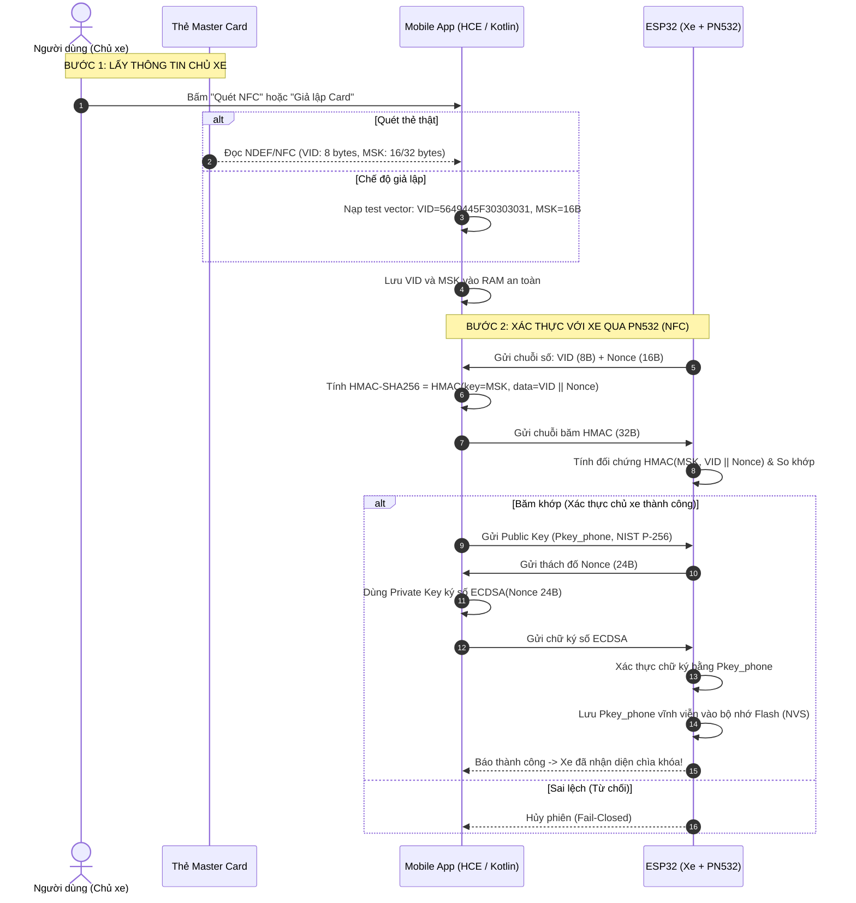
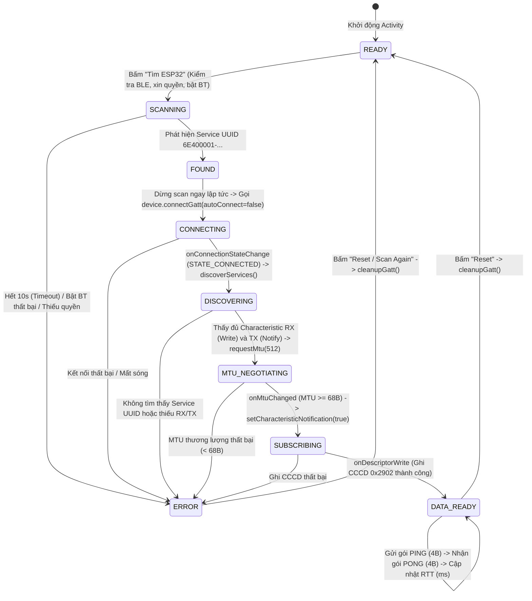

# SMART KEY MOBILE ACCESS (KOTLIN JETPACK COMPOSE)
## Module Ứng dụng Di động — Đồ án Hệ thống Smart Key Truy Cập Xe (BLE + UWB + NFC)

Module ứng dụng di động được xây dựng bằng **100% Native Kotlin + Jetpack Compose** (Android 14+ / minSdk 34, targetSdk 36), đóng vai trò là **Chìa khóa số cá nhân (Smartphone-as-a-Key / Digital Key Wallet)**.

Ứng dụng chịu trách nhiệm:
1. **NFC Provisioning:** Đọc / giả lập thẻ Master Card, tính mã xác thực `HMAC-SHA256` để đăng ký với xe qua đầu đọc PN532.
2. **BLE Central Pipeline (M1 Baseline):** Tự động phát hiện xe qua Service UUID, kết nối GATT, thương lượng MTU 512, đăng ký Notify qua CCCD `0x2902` và đo độ trễ đường truyền OTA RTT (Ping-Pong).

---

## 1. SƠ ĐỒ LUỒNG HOẠT ĐỘNG TOÀN DIỆN (SYSTEM FLOWCHARTS)

### Sơ đồ 1: Luồng NFC Provisioning & Xác thực Chủ xe
*(Khớp với sơ đồ kiến trúc `diagram_do_an-Trang-2.drawio.png` của nhóm)*



---

### Sơ đồ 2: State Machine 10 Trạng thái BLE Central GATT (M1 Baseline)
*(Mô hình hóa chính xác vòng đời trong `MainActivity.kt`)*



---

## 2. HỢP ĐỒNG GIAO DIỆN BLE GATT (INTERFACE CONTRACT)

Mobile App và ESP32 bắt buộc phải dùng chung bộ UUID này để không bị lệch pha:

| Thành phần GATT | UUID (128-bit) | Thuộc tính (Properties) | Chức năng kỹ thuật |
| :--- | :--- | :--- | :--- |
| **Service UUID** | `6E400001-B5A3-F393-E0A9-E50E24DCCA9E` | Primary | Đưa vào gói quảng bá (Advertising) để App lọc thiết bị |
| **RX Characteristic** | `6E400002-B5A3-F393-E0A9-E50E24DCCA9E` | `WRITE` | App gửi dữ liệu xuống khóa (PING, AuthReq, Public Key) |
| **TX Characteristic** | `6E400003-B5A3-F393-E0A9-E50E24DCCA9E` | `NOTIFY` | Khóa gửi dữ liệu về App (PONG, AuthResp, Nonce) |
| **Status Characteristic**| `6E400004-B5A3-F393-E0A9-E50E24DCCA9E` | `READ` \| `NOTIFY` | Đọc trạng thái khóa và dữ liệu cự ly tức thời |
| **CCCD Descriptor** | `00002902-0000-1000-8000-00805f9b34fb` | `READ` \| `WRITE` | Descriptor chuẩn Bluetooth SIG trên TX để kích hoạt Notify |

---

## 3. KIẾN TRÚC MÃ NGUỒN (MODULAR ARCHITECTURE)

Mã nguồn được tổ chức theo nguyên tắc phân tách trách nhiệm (Separation of Concerns):

* **`MainActivity.kt` (BLE Central Pipeline & UI Controller):**
  - **Quản lý quyền & phần cứng:** Kiểm tra `BLUETOOTH_SCAN`, `BLUETOOTH_CONNECT`, kích hoạt quét an toàn.
  - **Quản trị vòng đời kết nối GATT:** Kết nối trực tiếp (`autoConnect = false`), phát hiện dịch vụ (`discoverServices`), thương lượng MTU 512 bytes.
  - **Truyền nhận dữ liệu & Telemetry:** Đăng ký nhận thông báo CCCD `0x2902`, gửi gói `PING` (4 bytes), xác thực `PONG` (4 bytes) và tính toán độ trễ RTT (ms).
  - **Quản trị NFC Reader:** Nút kích hoạt NFC hardware để sẵn sàng quét thẻ Master Card vật lý.

* **`crypto/CryptoManager.kt` (Cryptographic Operations Provider):**
  - **Tương thích 1:1 với Mbed TLS 3.x trên ESP32 (`Crypto.cpp`).**
  - **SHA-256 Digest:** Băm dữ liệu với instance thread-safe cho BLE coroutines.
  - **HMAC-SHA256:** Mã xác thực thông điệp phục vụ Challenge-Response (xác thực không lộ MSK).
  - **ECDH NIST P-256:** Sinh cặp khóa tạm thời (ephemeral key pair) hỗ trợ Perfect Forward Secrecy.
  - **TLS ECPoint Wire Format (66 bytes):** Đóng gói/giải mã khóa công khai dạng `0x41 || 0x04 || 32B X || 32B Y` khớp trực tiếp hàm `mbedtls_ecdh_make_public()`.
  - **HKDF-SHA256 (RFC 5869):** Dẫn xuất khóa phiên đối xứng AES-128 (16 bytes) từ ECDH shared secret với chuỗi phân tách miền `"SmartKey-UWB-AES128-v1"`.

* **`mock/MockDataProvider.kt` (Test Bench & Offline Fixtures):**
  - Cách ly toàn bộ dữ liệu mẫu, test vector và thẻ giả lập phục vụ kiểm thử cục bộ mà không làm ô nhiễm Activity chính.
  - Đồng bộ `CAR_ID` (`01 02 03 04 05 06 07 08`) và `MSK` (`01 02 ... 20`) khớp hoàn toàn với `global_variable.h` của ESP32.

---

## 4. THÔNG SỐ GIAO TIẾP NFC HCE (CHO FIRMWARE ESP32 PN532)

* **Application ID (AID):** `F0 53 4D 41 52 54 4B 45 59` (9 bytes: `0xF0` Proprietary prefix + `"SMARTKEY"`)
* **Lệnh APDU Select AID:**
  ```text
  00 A4 04 00 09 F0 53 4D 41 52 54 4B 45 59 00
  ```
* **Mã phản hồi chuẩn (SW1-SW2):** `90 00` (Success).

---

## 5. HƯỚNG DẪN BUILD VÀ CHẠY DỰ ÁN

```bash
# Di chuyển vào thư mục dự án
cd "ĐACN/SmartKeyAccess"

# Biên dịch ứng dụng (Debug APK)
.\gradlew.bat assembleDebug
```
File APK cài đặt được xuất ra tại: `app/build/outputs/apk/debug/app-debug.apk`.

