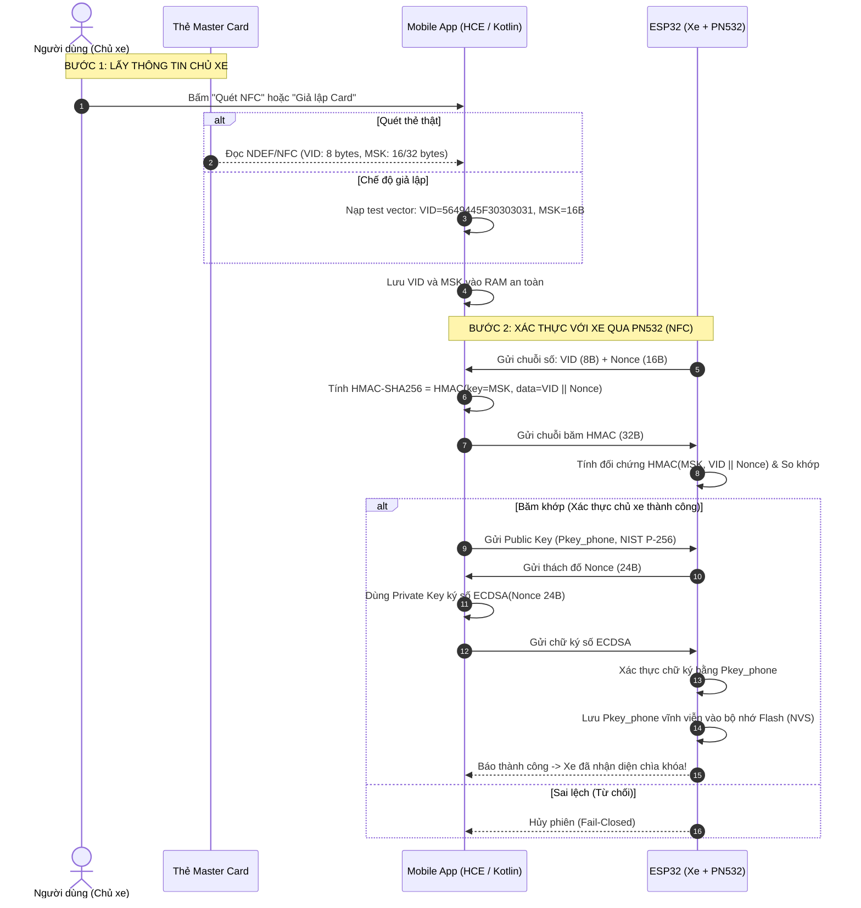
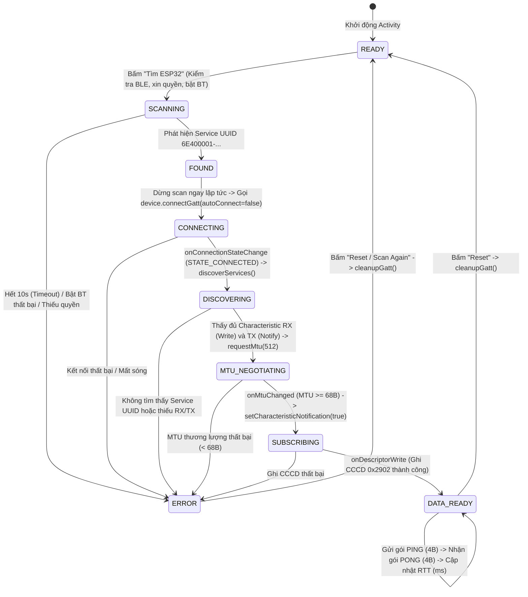

# SMART KEY MOBILE ACCESS (KOTLIN JETPACK COMPOSE)
## Module Ứng dụng Di động — Đồ án Hệ thống Smart Key Truy Cập Xe (BLE + UWB + NFC)

Module ứng dụng di động được xây dựng bằng **100% Native Kotlin + Jetpack Compose** (Android 14+ / minSdk 34, targetSdk 36), đóng vai trò là **Chìa khóa số cá nhân (Smartphone-as-a-Key / Digital Key Wallet)**.

Ứng dụng chịu trách nhiệm:
1. **NFC Provisioning:** Đọc / giả lập thẻ Master Card, tính mã xác thực `HMAC-SHA256` để đăng ký với xe qua đầu đọc PN532.
2. **BLE Central Pipeline (M1 Baseline):** Tự động phát hiện xe qua Service UUID, kết nối GATT, thương lượng MTU 512, đăng ký Notify qua CCCD `0x2902` và đo độ trễ đường truyền OTA RTT (Ping-Pong).

---

## 1. SƠ ĐỒ LUỒNG HOẠT ĐỘNG TOÀN DIỆN (SYSTEM FLOWCHARTS)

### Sơ đồ 1: Luồng NFC Provisioning & Xác thực Chủ xe
*(Khớp với sơ đồ kiến trúc `diagram_do_an-Trang-2.drawio.png` của nhóm)*



---

### Sơ đồ 2: State Machine 10 Trạng thái BLE Central GATT (M1 Baseline)
*(Mô hình hóa chính xác vòng đời trong `MainActivity.kt`)*



---

## 2. HỢP ĐỒNG GIAO DIỆN BLE GATT (INTERFACE CONTRACT)

Mobile App và ESP32 bắt buộc phải dùng chung bộ UUID này để không bị lệch pha:

| Thành phần GATT | UUID (128-bit) | Thuộc tính (Properties) | Chức năng kỹ thuật |
| :--- | :--- | :--- | :--- |
| **Service UUID** | `6E400001-B5A3-F393-E0A9-E50E24DCCA9E` | Primary | Đưa vào gói quảng bá (Advertising) để App lọc thiết bị |
| **RX Characteristic** | `6E400002-B5A3-F393-E0A9-E50E24DCCA9E` | `WRITE` | App gửi dữ liệu xuống khóa (PING, AuthReq, Public Key) |
| **TX Characteristic** | `6E400003-B5A3-F393-E0A9-E50E24DCCA9E` | `NOTIFY` | Khóa gửi dữ liệu về App (PONG, AuthResp, Nonce) |
| **Status Characteristic**| `6E400004-B5A3-F393-E0A9-E50E24DCCA9E` | `READ` \| `NOTIFY` | Đọc trạng thái khóa và dữ liệu cự ly tức thời |
| **CCCD Descriptor** | `00002902-0000-1000-8000-00805f9b34fb` | `READ` \| `WRITE` | Descriptor chuẩn Bluetooth SIG trên TX để kích hoạt Notify |

---

## 3. CẤU TRÚC CODE VÀ TRÁCH NHIỆM TỪNG HÀM (`MainActivity.kt`)

* **Khởi tạo và Điều phối quyền:**
  - `hasPermission()`: Kiểm tra quyền runtime `BLUETOOTH_SCAN` và `BLUETOOTH_CONNECT` (Android 12+ / API 31+).
  - `startFindingEsp32()`: Kiểm tra phần cứng BLE, adapter, kiểm tra Bluetooth bật/tắt và kích hoạt `startScan()`.
  - `stopScan()`: Dừng quét an toàn, hủy runnable timeout 10 giây.
* **Quản trị kết nối GATT & Vòng đời Radio:**
  - `connectToTarget()`: Thực hiện kết nối trực tiếp (`autoConnect = false`) để giảm thiểu độ trễ bắt tay vô tuyến.
  - `requestMtu(512)`: Thương lượng kích thước gói tin MTU tối đa để truyền trọn vẹn Public Key P-256 (65 bytes) không bị phân mảnh.
  - `subscribeToNotifications()`: Đăng ký lắng nghe cục bộ và ghi giá trị `0x0001` lên CCCD của TX Characteristic trên ESP32.
  - `sendPing()`: Ghi chuỗi byte `"PING"` xuống RX Characteristic, ghi nhận mốc thời gian nano-giây bằng `SystemClock.elapsedRealtimeNanos()`.
  - `cleanupGatt()` & `failGatt()`: Giải phóng triệt để tài nguyên `BluetoothGatt`, ngăn chặn rò rỉ bảng kết nối hệ điều hành Android (tránh lỗi GATT Error 133).
* **Module NFC & Mật mã:**
  - `simulateMasterCardRead()`: Nạp test vector chuẩn VID (8B) và MSK (16B).
  - `startNfcReader()`: Kiểm tra và kích hoạt lắng nghe chip NFC phần cứng.
  - `computeHmacSha256(key, data)`: Sử dụng `javax.crypto.Mac` tính toán mã xác thực bản tin toàn vẹn 32 bytes.
  - `testHmacVerification()`: Thực thi kịch bản giả lập nhận nonce từ ESP32 và băm đối chứng.

---

## 4. HƯỚNG DẪN BUILD VÀ CHẠY DỰ ÁN

```bash
# Di chuyển vào thư mục dự án
cd "ĐACN/SmartKeyAccess"

# Biên dịch ứng dụng (Debug APK)
# Windows:
.\gradlew.bat assembleDebug

# Hoặc dùng Java trực tiếp nếu đường dẫn có dấu tiếng Việt:
& java -jar .\gradle\wrapper\gradle-wrapper.jar assembleDebug
```
File APK cài đặt sẽ xuất hiện tại: `app/build/outputs/apk/debug/app-debug.apk`.
